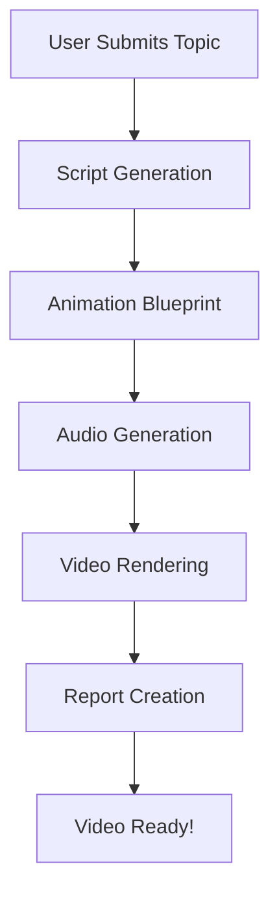

# Video Synthesis System - AI-Powered Video Generation Platform

## 🎯 User Story

**As a content creator**, I want to automatically generate educational videos from just a topic description, **so that** I can create high-quality video content without manual video editing skills.

### Problem Solved
Traditional video creation requires:
- Manual scripting
- Video editing expertise
- Voice recording equipment
- Hours of production time

### Solution Provided
This system automates the entire process:
1. **Input**: Just provide a topic (e.g., "How Machine Learning Works")
2. **Process**: AI handles script writing, voiceover, and video rendering
3. **Output**: Professional MP4 video ready to publish

---

## 📁 Project Structure

```
Video-Synthesis-System/
├── 📄 main.py                      # Application entry point
├── 📄 config.py                    # Configuration & settings
├── 📄 database.py                  # Database connection
├── 📄 models.py                    # Data models
├── 📄 requirements.txt             # Python dependencies
├── 📄 .env                         # Environment variables
│
├── 📂 api/                         # REST API Layer
│   ├── routes.py                   # API endpoints
│   └── websocket.py                # Real-time updates
│
├── 📂 services/                    # Core Business Logic
│   ├── script_generator.py         # AI script writing
│   ├── tts_generator.py            # Text-to-speech
│   ├── video_renderer.py           # Video creation
│   ├── lottie_renderer.py          # Animations
│   └── google_docs_service.py      # Report generation
│
├── 📂 workflows/                   # Orchestration
│   ├── video_workflow.py           # Main workflow
│   ├── workflow_nodes.py           # Processing steps
│   └── workflow_state.py           # State management
│
├── 📂 utils/                       # Helper Functions
│   ├── logger_config.py            # Logging setup
│   └── report_generator.py         # Report creation
│
├── 📂 generated_videos/            # Output videos
├── 📂 temp_files/                  # Temporary files
└── 📂 logs/                        # Application logs
```

---

## 🛠️ Tools & Technologies

### **Core Framework**
- **FastAPI** - Modern web framework for building APIs
  - Why? Fast, automatic documentation, async support
  
### **AI & LLM**
- **Mistral AI** - Large Language Model for script generation
  - Function: Analyzes topics and writes video scripts
  
### **Workflow Engine**
- **LangGraph** - Orchestrates multi-step processes
  - Function: Manages the flow from topic → script → video
  
### **Video Processing**
- **MoviePy** - Python video editing library
  - Function: Combines scenes, text, audio into MP4
- **FFmpeg** - Multimedia framework
  - Function: Encodes video files
- **ImageMagick** - Image processing
  - Function: Renders text overlays on video
  
### **Text-to-Speech**
- **Sarvam AI** - Indian language TTS service
  - Function: Converts script to Hindi/English audio
  
### **Database**
- **SQLAlchemy** - Database ORM
  - Function: Stores jobs, tracks progress
- **SQLite** - Lightweight database
  - Function: Persists application data

---

## 🎬 How It Works - Orchestrator Flow

### **Step-by-Step Process**



### **Detailed Workflow**

#### **1. Script Generation Node**
**File**: `workflows/workflow_nodes.py` → `script_node()`
- **Input**: Topic + style preferences
- **Tool**: Mistral AI LLM
- **Process**: 
  1. Analyzes the topic
  2. Breaks it into scenes (5-10 scenes)
  3. Writes narration text for each scene
- **Output**: Structured script with scenes

#### **2. Animation Blueprint Node**
**File**: `workflows/workflow_nodes.py` → `blueprint_node()`
- **Input**: Generated script
- **Tool**: Animation planner
- **Process**:
  1. Designs visual elements for each scene
  2. Plans transitions between scenes
  3. Defines colors and animation style
- **Output**: Visual blueprint (JSON format)

#### **3. Audio Generation Node**
**File**: `workflows/workflow_nodes.py` → `tts_node()`
- **Input**: Script narration text
- **Tool**: Sarvam AI TTS / Fallback options
- **Process**:
  1. Converts text to speech
  2. Applies voice styling
  3. Saves as MP3 file
- **Output**: Audio file path

#### **4. Video Rendering Node**
**File**: `workflows/workflow_nodes.py` → `render_node()`
- **Input**: Script + Blueprint + Audio
- **Tools**: MoviePy + FFmpeg + ImageMagick
- **Process**:
  1. Creates background clips
  2. Adds text overlays
  3. Synchronizes with audio
  4. Encodes to MP4
- **Output**: Final video file

#### **5. Report Generation Node**
**File**: `workflows/workflow_nodes.py` → `report_node()`
- **Input**: Complete job data
- **Tool**: Google Docs API (optional)
- **Process**:
  1. Summarizes video content
  2. Documents metadata
  3. Creates shareable report
- **Output**: Report URL or text file

---

## 🔧 Key Functions Explained

### **Core Service Functions**

#### **Script Generator** (`services/script_generator.py`)

**Main Function**: `generate_script(topic, style, duration)`
- **Purpose**: Creates video script using AI
- **Sub-functions**:
  - `_call_mistral_api()` - Communicates with AI
  - `_parse_script()` - Extracts scenes from response
  - `_validate_duration()` - Ensures timing is correct

#### **TTS Generator** (`services/tts_generator.py`)

**Main Function**: `generate_audio(text, language)`
- **Purpose**: Converts text to speech
- **Sub-functions**:
  - `_generate_sarvam()` - Uses Sarvam AI
  - `_generate_gtts()` - Uses Google TTS (fallback)
  - `_create_placeholder()` - Creates silent audio if TTS fails

#### **Video Renderer** (`services/video_renderer.py`)

**Main Function**: `render(blueprint, script, audio)`
- **Purpose**: Creates final MP4 video
- **Sub-functions**:
  - `_create_scene_clip()` - Makes individual scene
  - `_add_text_overlay()` - Adds text using ImageMagick
  - `_merge_audio()` - Combines video with voiceover

### **API Functions** (`api/routes.py`)

**Endpoint**: `POST /api/v1/video/generate`
- **Purpose**: Creates video generation job
- **Process**:
  1. Validates input data
  2. Creates database job record
  3. Starts background processing
  4. Returns job ID to user

**Endpoint**: `GET /api/v1/video/status/{job_id}`
- **Purpose**: Checks video generation progress
- **Returns**: Status, progress %, error messages

---

## 🚀 How to Run

### **Prerequisites**
- Python 3.11+
- FFmpeg installed
- ImageMagick installed
- Mistral API key

### **Quick Start**

1. **Install Dependencies**
```bash
pip install -r requirements.txt
```

2. **Configure Environment**
Edit `.env` file:
```env
MISTRAL_API_KEY=your_key_here
API_PORT=8001
```

3. **Start Server**
```bash
python main.py
```

4. **Access Application**
- API Docs: http://localhost:8001/docs
- Health Check: http://localhost:8001/health

### **Generate Your First Video**

**Option 1: Using Web Interface**
1. Go to http://localhost:8001/docs
2. Click "POST /api/v1/video/generate"
3. Click "Try it out"
4. Fill in the form:
```json
{
  "topic": "Introduction to Python",
  "style_analysis": {
    "style": "2D explainer",
    "colors": "blue,white,green",
    "animation_speed": "medium",
    "text_style": "bold",
    "transitions": "fade"
  },
  "llm_provider": "mistral"
}
```
5. Click "Execute"
6. Save the `job_id` from response

**Option 2: Using Code**
```python
import requests

response = requests.post(
    "http://localhost:8001/api/v1/video/generate",
    json={
        "topic": "Your topic here",
        "style_analysis": {
            "style": "2D explainer",
            "colors": "blue,white",
            "animation_speed": "medium",
            "text_style": "bold",
            "transitions": "fade"
        }
    }
)

job_id = response.json()["job_id"]
print(f"Video generating... Job ID: {job_id}")
```

**Check Progress**
```python
status = requests.get(
    f"http://localhost:8001/api/v1/video/status/{job_id}"
)
print(status.json())
```

**Download Video**
When status is "completed":
```python
video = requests.get(
    f"http://localhost:8001/api/v1/video/download/{job_id}"
)
with open("my_video.mp4", "wb") as f:
    f.write(video.content)
```

---

## 📊 Database Schema

### **VideoJob Table**
Tracks video generation jobs

| Column | Type | Description |
|--------|------|-------------|
| id | String | Unique job identifier |
| topic | String | Video topic |
| status | Enum | pending/processing/completed/failed |
| progress | Integer | 0-100% |
| video_path | String | Path to generated MP4 |
| created_at | DateTime | When job was created |
| completed_at | DateTime | When job finished |

---

## 🔍 Troubleshooting

### **Server won't start**
- Check port 8001 is available
- Verify FFmpeg path in `config.py`
- Check `.env` has API keys

### **Video generation fails**
- Check logs in `logs/` directory
- Verify Mistral API key is valid
- Ensure ImageMagick is installed

### **No audio in video**
- Normal if TTS services are offline
- System creates placeholder audio
- Check internet connection

---

## 📝 Configuration Options

### **Video Quality** (`config.py`)
```python
manim_quality = "medium_quality"  # low/medium/high
```

### **TTS Provider** (`.env`)
```env
TTS_PROVIDER=sarvam      # sarvam/gtts/edge_tts
TTS_LANGUAGE=hi          # hi (Hindi) / en (English)
```

### **LLM Provider** (`.env`)
```env
LLM_PROVIDER=mistral     # mistral/phi3
```

---

## 🎓 Learning Resources

- **FastAPI**: https://fastapi.tiangolo.com/
- **LangGraph**: https://langchain-ai.github.io/langgraph/
- **MoviePy**: https://zulko.github.io/moviepy/
- **Mistral AI**: https://docs.mistral.ai/

---

## 📄 License

This project is for educational purposes.

---

**Built with ❤️ using AI & Python**
